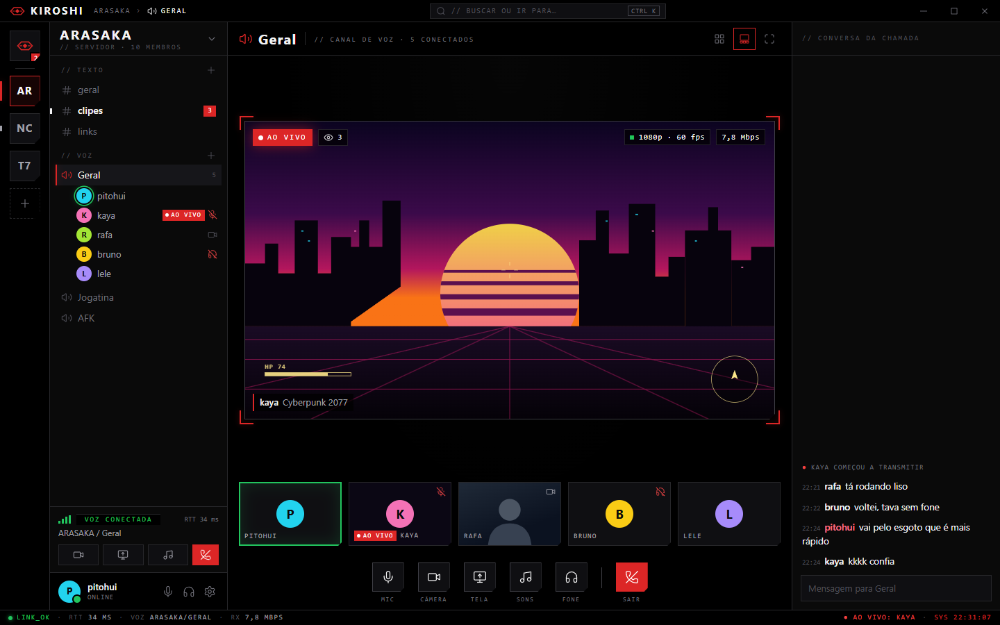
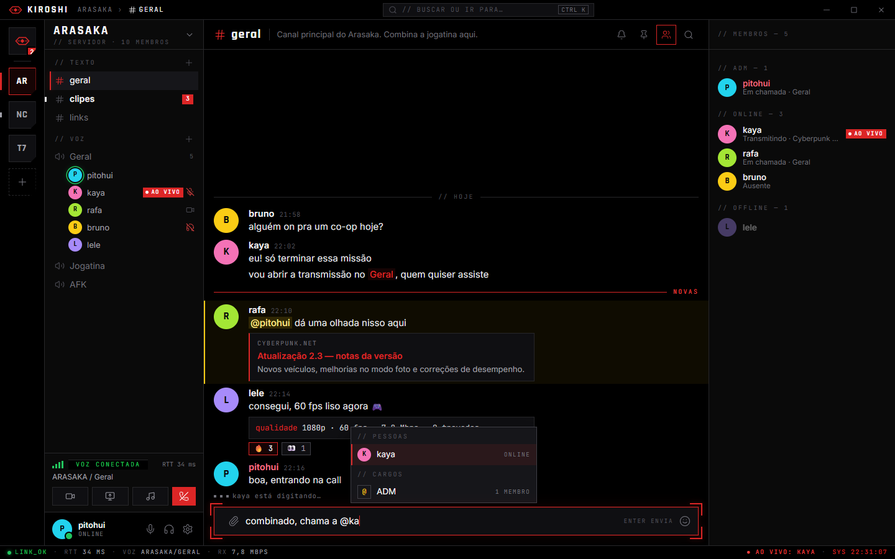
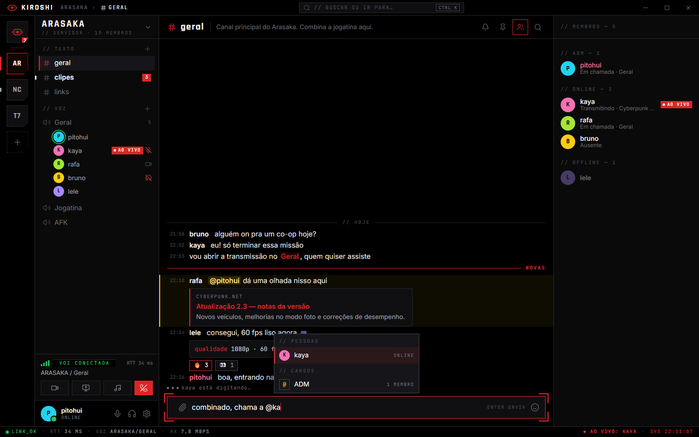
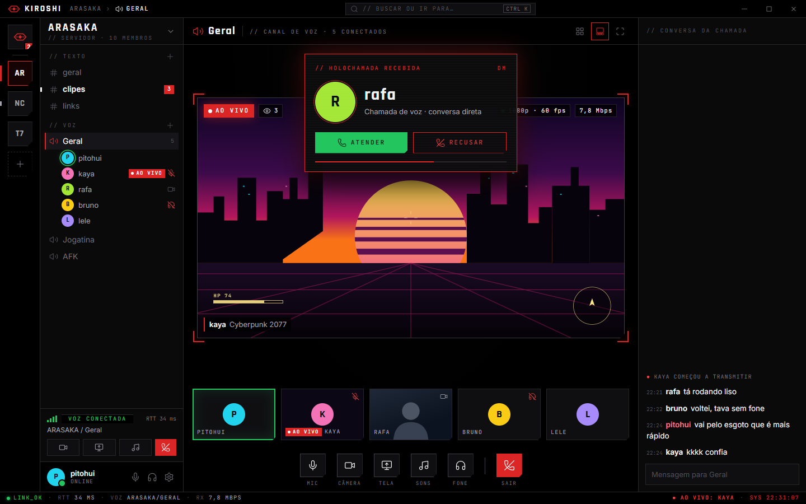

# Front-end novo do Kiroshi — design

> **Aprovado pelo dono em 2026-09-24, com a identidade em vermelho Arasaka.**
> E a especificacao da reescrita; o estado de cada fatia fica em
> [01-pedidos-e-backlog.md](01-pedidos-e-backlog.md#f1--front-end-novo). Escrito
> em 2026-09-24 a partir do estudo completo ([README](README.md)), da auditoria
> do front-end atual ([05](05-front-end-atual.md), [06](06-auditoria-de-ajustes.md)),
> do estudo de midia ([04](04-midia.md)) e do sistema de design do Arasaka Nexus
> (`arasaka-nexus/frontend/DESIGN.md`), que o dono indicou como referencia de
> como os front-ends dele sao trabalhados — referencia de familia, nao modelo a
> copiar.
>
> Prototipo visual da tela principal: [prototipo/index.html](prototipo/index.html)
> (abre em qualquer navegador; botoes no topo trocam a tela, a densidade e
> mostram a chamada recebida).
>
> As decisoes de design estao resumidas no fim (secao 9).

---

## 0. Como fica (prototipo estatico, 1440x900)

> **Decidido pelo dono em 2026-09-24: vermelho Arasaka (direcao A)**, o mesmo
> acento do Nexus. As capturas abaixo ja estao nela.

**Chamada com transmissao no palco:**



**Conversa, densidade confortavel** (mencao a voce em amarelo, divisor de novas,
cartao de link, autocompletar de mencao):



**Conversa, densidade compacta** (hora, nome e mensagem numa linha, sem avatar):



**Holochamada recebida** (chamada em DM):



Para ver ao vivo, com os botoes: abrir `prototipo/index.html` num navegador
(ou a configuracao `prototipo` do `.claude/launch.json` e
`/docs/conhecimento/prototipo/index.html`). A direcao B (ciano) continua no
botao do prototipo so como registro da alternativa considerada.

O prototipo ja pegou um defeito de desenho que o palco real nao pode ter: o
quadro 16:9 calculado so pela altura transbordava a coluna e cobria o painel da
direita. Regra: **o quadro cabe nas duas dimensoes** (unidades de container), e
com o painel aberto a transmissao fica menor — por isso quem assiste pede a
qualidade, em vez de deixar o tamanho do quadro decidir (secao 4.4).

---

## 1. Em uma pagina

**O que muda:** toda a camada de interface — telas, componentes, estilos,
navegacao, ajustes. **O que fica:** as camadas que ja provaram que funcionam —
cliente da API, gateway com retomada, store normalizado, logica pura testada, o
motor de voz (que sera dividido e consertado na frente de estabilidade) e a casca
Electron (com os consertos levantados).

**Identidade:** o Nexus e o *cofre* do universo Arasaka; o Kiroshi e a *optica*
— o modulo de comunicacao do KIROSHI_OS (o proprio boot do Nexus se anuncia
`ARASAKA NEXUS // KIROSHI_OS`). Mesma familia: preto em camadas, tres vozes
tipograficas (Rajdhani, JetBrains Mono, Inter), cantos vivos, brilho no lugar de
sombra, colchetes de canto, texto de sistema com cara de terminal, barra de
estado. Personalidade propria: o Nexus e uma biblioteca que voce le; o Kiroshi e
um HUD pelo qual voce **fala, ouve e ve** — o que muda o que tem que ser claro na
tela (quem esta falando, quem esta ao vivo, se o sinal esta bom).

**Promessas da interface nova** (o criterio de aceite de tudo):
1. **Nada de enfeite.** Todo controle na tela faz o que diz. O que nao esta
   pronto nao aparece.
2. **Estado sempre visivel e verdadeiro:** conexao, microfone, quem fala, quem
   transmite, qualidade real da transmissao, erros. Nenhum erro engolido.
3. **A transmissao e o centro.** O palco pede a qualidade certa, o video nunca
   e recriado ao trocar de tela, e janela escondida para de baixar video.
4. **Rapida com a chamada rodando.** A interface nao re-renderiza por relogio;
   so o que mudou se redesenha.
5. **Diegetica, mas legivel.** A ficcao mora no chrome (rotulos, carregamento,
   estado, boot), nunca no conteudo: mensagem e texto limpo.
6. **Acessivel:** tudo por teclado, leitor de tela, foco visivel, contraste AA,
   movimento que respeita a preferencia de verdade.
7. **Portugues correto, com acento**, como no Nexus ("Catalogo", "Mangas").

---

## 2. Linguagem visual

### 2.1 Cor

Superficies e texto herdam o Nexus (os mesmos valores, para a familia se
reconhecer):

| Token | Valor | Uso |
|---|---|---|
| `--bg-void` | `#000000` | chao da janela |
| `--bg-deck` | `#0a0a0a` | paineis, colunas |
| `--bg-terminal` | `#0f0f12` | superficies elevadas, campos |
| `--bg-elevated` | `#16161a` | menus, popovers (nunca mais claro que isto) |
| `--fg-primary` | `#f4f4f5` | texto |
| `--fg-secondary` | `#a1a1aa` | rotulos (8,4:1 no deck) |
| `--fg-muted` | `#52525b` | dica — nunca em texto de leitura |
| `--border-faint` / `--border-mid` | `#27272a` / `#3f3f46` | bordas |

**Semantica de estado — fixa nas duas direcoes**, porque num app de voz a cor
de estado e informacao, nao decoracao:

| Estado | Cor | Forma (sempre junto, por causa de daltonismo) |
|---|---|---|
| Falando | verde `#22c55e` | anel luminoso no avatar/quadro |
| Ao vivo / transmitindo | vermelho Arasaka `#dc2626` | selo `● AO VIVO` solido |
| Mudo, surdo, desconectar, perigo, erro | vermelho | icone cortado, `[!]`, texto |
| Mencao a voce | amarelo `#facc15` | regua a esquerda + fundo tenue |
| Sinal instavel / aviso | amarelo | barras de sinal, texto |
| Sinal bom / sucesso | verde | barras de sinal, `[OK]` |

**A cor da identidade — DECIDIDO: A, vermelho Arasaka `#dc2626`** (hover
`#ef4444`), como o Nexus. O vermelho carrega identidade, selecao, foco, botao
principal, ao vivo e perigo; o que separa os estados e a **forma**: selecao =
barra lateral + colchetes; ao vivo = selo solido `● AO VIVO` com pulso; mudo e
surdo = icone cortado; erro = `[!]` + texto; perigo (sair, apagar) = botao
solido com rotulo explicito. As opcoes que estavam na mesa:

| | A. Arasaka (vermelho) | B. Optica Kiroshi (ciano) — **recomendada** |
|---|---|---|
| Acento | `#dc2626` (como o Nexus) | `#22d3ee` (o neon ciano do Nexus, promovido) |
| Vermelho | identidade + acao + ao vivo + perigo (sobrecarga intencional, como no Nexus) | so marca, ao vivo e perigo |
| A favor | familia identica ao Nexus | num app de voz, "selecionado" nunca parece "mudo" ou "erro"; o `● AO VIVO` vermelho salta sozinho no palco; ciano e a cor de "optica/scanner" |
| Contra | canal selecionado, microfone mudo e erro ficam da mesma cor | se afasta um passo do Nexus (a marca continua vermelha) |

O prototipo tem as duas lado a lado (botao no topo).

**Tema claro:** o dono usa e funciona hoje. Proposta: manter como tema
**"Corporativo"** (a Arasaka de dia: `#f4f4f5`, texto `#09090b`, os mesmos
acentos escurecidos para contraste), segundo em prioridade — os tokens tornam o
custo baixo. Mais **"Seguir o sistema"**, que hoje nao existe.

### 2.2 Tipografia — tres vozes

Regra herdada do proprio Kiroshi (commit `b7904ba`) e do Nexus: **se e para ser
LIDO, Inter; se e para ser LOCALIZADO, mono; se e para ser VISTO, Rajdhani.**

| Voz | Fonte | Onde |
|---|---|---|
| Visto | Rajdhani 600/700 | nome do servidor, titulos de tela, numeros grandes, a marca |
| Localizado | JetBrains Mono 400/500 | rotulos `// SECAO`, botoes, horarios, estado, dados tecnicos, atalhos |
| Lido | Inter 400/500/600 | mensagens, nomes de pessoas, descricoes, textos de ajuda |

Escala (px): 10 · 11 · 12 · 13 · 14 · **15 (mensagem)** · 16 · 20 · 28 · 36 · 48.
Mono em caixa alta com `0.2em` de espacamento; titulos Rajdhani com `-0.02em`.
Fontes empacotadas no app (ja existem em `src/styles/fontes`), nada de CDN.

### 2.3 Forma

- Raio **0** por padrao; 2 px em chips; **4 px no maximo**. Avatar de pessoa e o
  unico redondo (regra do Nexus).
- **Chanfro** (canto cortado por `clip-path`) no botao principal, nos icones de
  servidor e nos quadros do palco — a assinatura atual do Kiroshi, mantida.
- **Colchetes de canto** (os `[ ]` do Nexus) marcam foco e o que esta ativo:
  campo focado, quadro em destaque, item selecionado.
- Bordas de 1 px sao o limite entre areas; **sem sombra suave**. Profundidade
  vem de brilho (`--glow`) e de camadas de preto.

### 2.4 Texturas e efeitos (com parcimonia)

| Efeito | Onde | Com movimento reduzido |
|---|---|---|
| Grade de 24 px a 6% | tela de entrada, estados vazios | fica (e estatica) |
| Linhas de varredura a 4% | boot, chamada recebida | some |
| Glitch em rajada (6 s, 15% visivel) | so titulos grandes: entrada, erro de conexao, 404 | some |
| Aberracao cromatica no hover | links | some |
| Sobreposicao CRT | **opcional**, desligada por padrao (atrapalha leitura longa) | some |

### 2.5 Icones

`lucide-react` (o mesmo do Nexus), traco **1,5**, tamanhos 12/14/16/20/24,
sempre `currentColor`. Glifos tipograficos da familia: `//` (secao), `▸` (acao),
`›` (caminho), `■ □` (estado), `[!]` (alerta), `[OK]`. **Sem emoji na interface**
(nas mensagens, claro, a vontade).

Marca: um **olho-optica** geometrico (losango com fenda horizontal e pupila),
em vermelho Arasaka — prova no prototipo. O icone do app e o da bandeja saem dela.

### 2.6 Movimento

Rapido e com funcao. Duracoes 80 / 120 / 200 ms; saida `cubic-bezier(0.16, 1,
0.3, 1)`.

- **Boot** ao abrir o app (uma vez por execucao, ~1 s, pula com qualquer tecla):
  linhas de terminal que **mostram o que esta acontecendo de verdade** (sessao,
  gateway, voz) — nao so decoracao.
- Troca de servidor: varredura de 200 ms. Troca de canal: sem animacao (troca-se
  canal dezenas de vezes por hora).
- Anel de fala: 120 ms. Selo ao vivo: pulso lento. Toasts: deslizam.
- Palco: quadros mudam de lugar por FLIP, **sem recriar o video**.

Tres niveis que funcionam de verdade: **Seguir o sistema** (padrao),
**Completo** (liga tudo, mesmo com as animacoes do Windows desligadas — o caso
da maquina do dono), **Reduzido** (so o essencial: spinner, anel de fala sem
transicao).

### 2.7 Som

Familia unica de sons de HUD (curtos, secos, sinteticos): entrar/sair da voz
(**sempre ligado** — decisao do dono), mutar/desmutar, ensurdecer, transmissao
iniciada/encerrada, espectador entrou, chamada recebida/feita, mensagem (quando a
notificacao pede). Todos saem **pelo mesmo dispositivo e volume da chamada**
(hoje saem no dispositivo padrao, ignorando o ajuste).

### 2.8 Voz do texto

Dois registros, como no Nexus:

- **Sistema** (chrome, estado, carregamento, erro): mono, CAIXA ALTA, curto,
  portugues. `LINK ESTAVEL`, `RECONECTANDO…`, `SINAL INSTAVEL`, `AO VIVO`,
  `TRANSMISSAO ENCERRADA`, `ACESSO NEGADO`. Termos tecnicos curtos em ingles so
  onde e natural (`RTT`, `LINK`, `UPTIME`).
- **Operador** (explicacao, ajuda, confirmacao): frase normal, clara, direta.
  "Voce saiu da chamada porque ficou sozinho por 3 minutos." — nunca "Oops!".

Na interface os textos sao **com acento** (`AO VIVO`, `Configurações`,
`Transmissão`); os exemplos deste documento seguem a convencao sem acento do
repositorio.

Chamar a pessoa de "agente", como o Nexus faz: so no boot
e na entrada ("Bem-vindo de volta, agente."), nunca no uso diario.

---

## 3. Estrutura da janela

Mantem o modelo mental do Discord — o grupo veio de la, e a memoria muscular
vale ouro —, reinterpretado como HUD:

```
+----------------------------------------------------------------------------------+
| <> KIROSHI   ARASAKA > # geral          [ // BUSCAR  Ctrl K ]     (o) _  []  X    |  barra de titulo, 32 px
+------+----------------+---------------------------------------+-----------------+
| RAIL | ARASAKA      v |                                       |  PAINEL         |
|  72  | // TEXTO       |          AREA PRINCIPAL               |  (opcional)     |
|      |  # geral    3  |                                       |                 |
| [H]  |  # clipes      |   conversa  |  palco  |  inicio | DM   |  membros        |
| [A]  | // VOZ         |                                       |  ou conversa    |
| [N]  |  )) Geral      |                                       |  da chamada     |
| [+]  |     (o) kaya   |                                       |  ou perfil      |
|      |     (o) rafa   |                                       |                 |
|      +----------------+                                       |                 |
|      | VOZ CONECTADA  |                                       |                 |
|      | ARASAKA/Geral  |                                       |                 |
|      | [mic][fone][x] |                                       |                 |
|      | (o) pitohui  * |                                       |                 |
+------+----------------+---------------------------------------+-----------------+
| * LINK_OK . RTT 34 ms . VOZ ARASAKA/GERAL . TX 6,1 Mbps . AO VIVO . 22:31:07     |  barra de estado, 22 px
+----------------------------------------------------------------------------------+
```

- **Barra de titulo** (32 px, arrastavel): marca, caminho (`servidor › #canal`),
  busca global (`Ctrl+K`, tambem paleta de comandos), estado da conta, janela.
- **Trilho** (72 px): Inicio (DMs), servidores (quadrados chanfrados; barra de
  acento = selecionado; ponto = nao lido; numero = mencoes), criar/entrar.
- **Navegacao** (240–280 px, redimensionavel): cabecalho do servidor com menu;
  canais com `//` nas categorias; canais de voz com quem esta dentro (avatar, anel
  de fala, icones de mudo/surdo/camera/ao vivo). **Embaixo: o painel da voz
  conectada** (canal, sinal, desconectar, microfone, fone, camera, tela) e a
  **identidade** (avatar, nome, status, ajustes) — onde o Discord os poe.
- **Area principal:** conversa, palco, inicio ou DM.
- **Painel direito** (300 px, recolhivel): membros agrupados por cargo, conversa
  da chamada, ou perfil.
- **Barra de estado** (22 px, a "faixa de instrumento" que o Kiroshi ja tem,
  agora com dado que presta): link, RTT, onde voce esta em voz, taxa de envio
  quando transmite, relogio.

A barra HUD de 64 px de hoje some: as coisas dela vao para o painel da voz e para
a identidade, devolvendo altura ao palco.

Larguras: >= 1280 tudo em colunas; menor que isso o painel direito vira gaveta;
menor que 1024 a navegacao tambem.

---

## 4. Telas

### 4.1 Boot e entrada

Boot curto (secao 2.6). Entrada num "terminal seguro" (a moldura do login do
Nexus, com a marca Kiroshi): **Entrar** (email ou usuario + senha, 2FA), **Criar
conta** (sem convite — o servidor ja suporta; so muda a configuracao e as
protecoes), **Continuar com Google** (cria ou entra), **Esqueci a senha** (pelo
Google; email so se houver servico de envio — ver [01](01-pedidos-e-backlog.md#f4--conta-cadastro-sem-convite-com-google)).
Conta nova cai no **Inicio vazio** ("Sua rede comeca aqui": adicionar amigo, criar
servidor, entrar por convite). Conta criada pelo Google mostra um aviso fixo e
dispensavel: **"Defina uma senha para entrar tambem com email"**.

### 4.2 Inicio e DMs

Coluna de navegacao vira: amigos, pedidos, e as conversas diretas (com contador,
indicador de chamada ativa e de "em chamada em ARASAKA/Geral"). Area principal:
**Amigos** (online / todos / pendentes enviados e recebidos / bloqueados;
adicionar por usuario; conversar; ligar; remover; bloquear) e um quadro "agora"
(quem esta em voz e onde, quem esta ao vivo — um clique entra).

Pedido de amizade (2.0.8, pedido do dono em 2026-09-26: "como eu faco?"): o
**cartao de perfil** tem o botao — Adicionar amigo, Aceitar pedido de amizade
(quem ja te convidou) ou Pedido enviado —, sem precisar saber o @usuario. No
"Adicionar amigo" do Inicio, o campo sugere gente dos servidores em comum pelo
nome de exibicao ou de usuario (um clique preenche), e nome de exibicao digitado
("Nilton Ferreira") explica o que falta em vez do "campos invalidos" do
servidor; usuario inexistente diz "ninguem usa @x".

### 4.3 Conversa (canal de texto e DM)

- Cabecalho: `# canal` + topico; acoes fixadas, busca, membros; em DM: **ligar
  (voz)** e **ligar (video)**.
- Mensagens em duas densidades de verdade:
  - **Confortavel:** avatar 40 px, nome (cor do cargo) + hora mono na linha de
    cima, conteudo embaixo, grupos separados por respiro.
  - **Compacta:** sem avatar, `22:31  nome  mensagem` numa linha so (como o
    compacto do Discord).
- Mencao a voce: regua amarela + fundo tenue. Divisor de nao lidas vermelho
  `NOVAS`. Fixada: marca ciano.
- Acoes da mensagem (reagir, responder, editar, fixar, copiar, apagar) no hover
  **e** por teclado (setas navegam mensagens; `Enter` abre o menu).
- Menção de cargo e pessoa com o mesmo nome (2.0.8, o caso do dono: usuario
  `adm`, cargo "ADM"; antes a pessoa sempre ganhava e o cargo nao tinha como
  ser mencionado). No envio (`paraEnvio`, `mencoes.ts`) vale, nesta ordem: o
  que foi escolhido na lista do autocompletar; o nome escrito na caixa exata
  (nome de usuario e sempre minusculo, entao `@ADM` igual ao cargo e o cargo e
  `@adm` e a pessoa); sem caixa, pessoa antes de cargo. Editar uma mensagem
  parte das mencoes que ela ja tinha (`escolhasDoConteudo`).
- Compositor: **autocompletar** de `@pessoa`, `@cargo`, `#canal`, `:emoji:`;
  anexos com previa e progresso; responder; editar a ultima com seta para cima;
  **Enter envia, Shift+Enter quebra linha** (sem opcao).

### 4.4 Chamada e palco

O coracao do produto.

- **Canal de voz aberto:** o palco ocupa a area principal; conversa da chamada no
  painel direito.
- **Layouts:** grade (todos), destaque (um grande + fita), tela cheia, e **mini
  palco flutuante** quando voce navega para outro canal com a chamada ativa — o
  mesmo elemento de video, movido, nunca recriado.
- **Mini palco numa janela propria (2.0.7, pedido do dono em 2026-09-26: "devo
  poder mover ela livremente pelo computador e redimensionar, clicar e ter a
  opcao de voltar para a tela da chamada").** No app instalado a miniatura e
  uma janela do Windows sem moldura, sempre por cima e fora da barra de tarefas
  (`electron/miniPalco.ts`), desenhada pelo React por portal
  (`JanelaFlutuante.tsx`, com os estilos do app copiados para la):
  - arrasta por qualquer ponto da imagem, inclusive para outro monitor (o
    arraste pede a posicao ao processo principal: o `window.moveTo` do
    navegador prendia a janela na beirada do monitor em que ela estava);
    redimensiona pelas beiradas, travada em 16:9; abre onde a pessoa a deixou
    (`limitesDaMiniatura.ts`), e o processo principal a traz para dentro se o
    monitor sumiu;
  - um clique abre as opcoes: **Voltar para a chamada** (traz o app de volta,
    mesmo minimizado ou na bandeja, e abre a chamada), **Fechar miniatura**
    (vale ate a pessoa passar pela tela da chamada de novo; fechar pelo sistema
    conta igual) e **Sair da chamada**; o × no canto fecha direto;
  - continua tocando com o app minimizado; a qualidade pedida segue a altura
    DA JANELA (`useRecepcaoDaJanela`): os observadores do documento do app nao
    enxergam elementos de outra janela e pausariam o video;
  - abre sem roubar o foco (`showInactive`). Na versao web continua presa no
    canto da pagina.
  - Medido no Beta: video 1280x720 tocando na janela; arrastes exatos, um
    deles atravessando para o monitor da esquerda; reabre na posicao e no
    tamanho salvos; 1120x630 pede a camada alta, 480x270 a media; voltar poe a
    chamada na tela com o video tocando no palco (o mesmo elemento); com o app
    minimizado a miniatura segue tocando. No teste, eventos de mouse sinteticos
    do CDP podem vir com `screenX` sem a posicao da janela: arraste de verdade
    so com mouse real.
- **Quadro de pessoa:** avatar ou camera; anel verde de fala; nome em mono;
  icones de mudo/surdo; qualidade do sinal.
- **Foto em GIF anima quando a pessoa fala** (2.0.4, pedido do dono em
  2026-09-26; servidor em [03-servidor.md](03-servidor.md), "Foto de perfil"). O
  `Avatar` (`design/primitivos/Avatar.tsx`) recebe `urlAnimada` e anima com
  `falando` (anel + animacao: lista de voz e quadro da chamada) ou `animar` (so
  a animacao: o proprio painel da conta enquanto eu falo, o cartao de perfil, o
  cartao da chamada e a previa da tela de Perfil). Em todo o resto, a parada.
  - A animada entra **por cima** da parada: carregando, aparece a parada, nunca
    um buraco. Continua **1,2 s** depois da fala (o "falando" do SFU vai e volta
    entre palavras; sem isso o GIF recomecaria a cada pausa).
  - Sempre do **primeiro quadro**, colado na foto parada: os bytes sao baixados
    uma vez (`fetch`, antes da fala) e cada fala ganha um `blob:` novo. Pelo
    endereco direto, o Chromium divide uma animacao entre as copias: com o
    cartao da pessoa aberto, a foto da lista entrava no quadro 4 de 12 (medido).
  - Anima mesmo com o movimento reduzido do Windows: e a foto que a pessoa
    escolheu, disparada pela voz dela.
  - Medido no Beta (dois Betas por CDP, LiveKit local, microfone falso com fala
    em rajadas, GIF de 12 cores): 12 de 12 comecos no quadro 0, nos dois lados;
    pausa curta nao reinicia; volta a parada 1,2 s depois; uma descarga por
    janela.
- **Quadro de transmissao:** selo `● AO VIVO` vermelho, espectadores, e a
  **qualidade real recebida** (`1080p · 60 fps`, em mono), com "travadas nos
  ultimos 30 s" quando houver. Antes de assistir: cartao "fulano esta
  transmitindo — ASSISTIR" (assinatura sob demanda, como hoje). Qualidade:
  **Automatica** (pela janela, mas pedindo a camada certa — nunca 360p15 porque o
  quadro e pequeno) ou fixa.
- **Controles** no pe do palco: microfone, camera, tela, soundboard, fone,
  **sair** (vermelho). Clique direito numa pessoa (com permissao): silenciar,
  ensurdecer, mover para..., desconectar, dar cargo; arrastar a pessoa para outro
  canal de voz move.
- **Seletor de tela:** janelas e telas com miniatura + **o que voce vai
  transmitir**: *Jogo* (fluidez: `motion`, prioriza fps) ou *Texto/codigo*
  (nitidez: `detail`, prioriza resolucao) + qualidade (720p30, 1080p30, 1080p60)
  + incluir som. Os consertos de codificacao e captura vem de
  [04-midia.md](04-midia.md).
- **Soundboard:** grade de sons do servidor com previa, na barra da chamada.

### 4.5 Chamada em DM ("holochamada")

- Botoes de ligar no cabecalho da DM; a chamada abre no topo da conversa (como no
  Discord), com os mesmos quadros e controles do palco.
- **Chamada recebida:** cartao flutuante com o avatar numa moldura de varredura,
  nome, "HOLOCHAMADA RECEBIDA", **Atender** (verde) e **Recusar** (vermelho), som de
  toque e notificacao do Windows; toca por ~30 s.
- Mensagens de sistema na conversa: chamada iniciada, duracao, chamada perdida.
- **Sozinho por 3 minutos -> desconecta**, com aviso proprio no mesmo tom de humor
  (texto nosso, nao o do Discord).

### 4.6 Ajustes do usuario (so o que funciona)

| Grupo | Paginas |
|---|---|
| CONTA | Meu perfil · Conta e seguranca (email, senha, 2FA, Google, **dispositivos conectados**, excluir conta) |
| COMUNICACAO | Voz e video (entrada, **sensibilidade com medidor em dB e marca do limiar**, modo voz/apertar-para-falar, saida, volume, **camera com previa**, teste de microfone) · Transmissao (padroes) · Notificacoes (desktop, sons, contador, piscar, nao perturbe) · Atalhos (**globais**: falar, mutar, ensurdecer) |
| APLICATIVO | Aparencia (tema, densidade, tamanho do texto, movimento, efeitos) · Windows (**iniciar com o Windows** — ligado por padrao —, iniciar na bandeja, fechar para a bandeja) · Sobre e atualizacoes · Diagnostico (com metricas de video) |

Supressao de ruido: a pagina tem o lugar dela, mas o conteudo e da fase F3 (refeita
do zero). Ate la, so o que funciona hoje, sem prometer o que nao entrega.

### 4.7 Ajustes do servidor (como o Discord organiza)

| Grupo | Paginas |
|---|---|
| SERVIDOR | Visao geral (icone, nome, descricao, canal de sistema, notificacao padrao) |
| PESSOAS | **Membros** (lista com cargos, dar/tirar cargo, apelido, expulsar, banir) · **Cargos** (lista ordenavel; editor com abas Exibicao / Permissoes / Membros; "ver como este cargo") · Convites (lista, revogar, criar link) · Banimentos |
| CONTEUDO | **Canais** (arvore editavel; permissoes por canal em tres estados negar / herdar / permitir; "sincronizado com a categoria") · Emojis · Soundboard |
| MODERACAO | Registro de auditoria (filtro por pessoa e acao) |
| | Excluir servidor |

Dar cargo tambem pelo perfil da pessoa (`+` nos cargos) e pelo clique direito.

### 4.8 Convite

Janela com **link** (`order.arasaka.fun/convite/<codigo>`), validade e usos, e a
lista de amigos com botao **Convidar** (vai por DM). O link abre o app
(`kiroshi://`) ou, sem o app, uma pagina que explica e oferece o instalador.

### 4.9 Estados que toda tela tem

Vazio (texto de operador + acao), carregando (esqueleto + linha de sistema),
erro (inline no lugar + toast; **nada engolido**), sem conexao (faixa com o que
esta acontecendo e o tempo ate a proxima tentativa), atualizacao pronta (faixa —
**nunca interrompe uma chamada**; instala quando for seguro).

---

## 5. Comportamentos

- **Notificacoes:** nivel por servidor e por canal (todas / so mencoes / nada),
  silenciar por 15 min, 1 h, 8 h, 24 h ou ate desligar, suprimir @everyone;
  notificacao do Windows com o icone certo; **clique abre a conversa**; nao
  perturbe silencia; contador de mencoes no icone da barra de tarefas; piscar em
  mencao.
- **Links diretos:** a navegacao vira rota (`#/g/<servidor>/c/<canal>`, `#/dm/<id>`),
  o que da voltar/avancar (inclusive os botoes laterais do mouse), notificacao que
  abre o lugar certo, e convite por link.
- **Atalhos globais** (com jogo na frente): falar, mutar, ensurdecer. Apertar-para-
  falar de verdade (segurar) exige ouvir a tecla solta, que o Electron nao da —
  **[a estudar na F1]** um modulo nativo de teclado que nao prenda a tecla do jogo.
- **Fechar = bandeja**; sair pela bandeja. Iniciar com o Windows escondido na
  bandeja.

---

## 6. Arquitetura tecnica

| Decisao | Escolha | Motivo |
|---|---|---|
| Base | Electron + React 19 + Vite + Zustand (fica) | funciona; a troca e so da camada de interface |
| Estilo | **Tailwind v4** + tokens em variaveis CSS + uma camada pequena de CSS de assinatura (colchetes, varredura, glitch) | e o que o Nexus usa; acaba com a guerra de especificidade das 7 mil linhas de hoje; tokens fazem tema e direcao de cor custarem uma troca de variavel |
| Primitivos | **Radix UI** (dialog, menu, menu de contexto, popover, tooltip, select, slider, switch, tabs) estilizados por nos | acessibilidade de teclado e leitor de tela pronta e testada |
| Icones / toasts | `lucide-react` / `sonner` | os mesmos do Nexus |
| Rotas | roteador por hash (pequeno, sem dependencia pesada) | links diretos, voltar/avancar, notificacao que abre a conversa |
| Estado | store atual + seletores finos + `memo` nas listas; estado so de interface num store proprio pequeno | fim do re-render do app inteiro a cada evento |
| Voz | o motor atual (`src/voice`), consumido pela API publica dele; niveis de audio por ref, fora do React | o palco nao re-renderiza 5x por segundo |

Organizacao:

```
src/
  app/        casca, rotas, provedores (tema, toasts, camadas), boot
  design/     tokens.css, base.css, assinatura.css, primitivos (Button, Field, Switch, ...)
  features/   entrada/ inicio/ dm/ servidor/ conversa/ chamada/ palco/
              ajustes-usuario/ ajustes-servidor/ convites/ notificacoes/ busca/
  api/ store/ lib/ voice/ hooks/     (os de hoje)
```

**Versao web (depois):** a interface nova fala com o sistema so pela ponte
(`window.kiroshi`), que ja tem substituto para navegador (`src/lib/bridge.ts`), e
as rotas por hash funcionam fora do Electron. A mesma interface pode virar o
Kiroshi no navegador sem reescrita — o que muda e o que o navegador nao deixa
(escolher janela para transmitir, bandeja, atalho global), que some da tela
em vez de aparecer quebrado.

**Testes:** testes de componente (Vitest + Testing Library) para primitivos e
fluxos; a **vitrine** renasce como catalogo de componentes (`?vitrine`) com
atributos de teste estaveis (`data-testid`); os roteiros CDP de hoje sao
refeitos sobre ela e contra **servidor de teste isolado** — nunca o servidor do
grupo. Cada fatia so fecha com typecheck limpo, testes verdes e a vitrine passando.

---

## 7. Como vai chegar ao grupo

A atualizacao automatica entrega qualquer defeito de interface a todos em ~10
minutos, entao a interface nova **nao substitui a atual pela metade**:

1. Construcao num ramo proprio; o dono recebe um **"Kiroshi Beta"** instalado ao
   lado do normal (outro `appId`, outra pasta de dados, atualizacao so do beta),
   conectado ao servidor de verdade com a conta dele.
2. Cada fatia abaixo vira uma versao beta para o dono usar e aprovar.
3. Quando o beta cobrir o uso diario (fatias 1 a 5), vira a versao normal para
   todos. O resto chega como atualizacao.

| # | Fatia | Pronto quando |
|---|---|---|
| 1 | Fundacao: tokens, tipografia, primitivos, casca, rotas, toasts, boot, vitrine nova | casca navegavel com dados reais; vitrine com todos os primitivos; teclado e leitor de tela ok |
| 2 | Conversa | paridade com hoje + densidade real + autocompletar + acoes por teclado |
| 3 | Chamada e palco | video sem recriar; qualidade certa para quem assiste (medida); mini palco; soundboard tocavel; moderacao de voz |
| 4 | Inicio, amigos e DM + chamada em DM com toque e regra dos 3 minutos | ligar e atender de um aparelho para outro |
| 5 | Ajustes do usuario + notificacoes reais + iniciar com o Windows + atalhos globais | nenhum ajuste decorativo |
| 6 | Ajustes do servidor completos + dar cargo + convites por link | as queixas de cargo resolvidas |
| 7 | Entrada e conta: cadastro aberto, Google + aviso de senha, recuperacao | conta nova do zero ate a primeira chamada |

As partes de servidor de cada fatia (chamada em DM, cargos, convites,
notificacoes) andam junto com a interface.

**Feito (2026-09-25):** as sete fatias entraram no Beta ao longo do dia, e o dono
aprovou a troca: a interface nova saiu para todos na **2.0.0** do Kiroshi, pela
atualizacao automatica. O Beta continua como canal de teste
([07](07-desktop-e-entrega.md)).

---

## 8. Decisoes que tomei (vete o que nao quiser)

- Textos da interface **com acento**.
- **Tailwind v4 + Radix + lucide + sonner**, alinhado ao Nexus.
- Modelo do Discord para a disposicao da janela.
- Tema claro mantido como "Corporativo", mais "seguir o sistema".
- Beta lado a lado antes de trocar para todos.
- Som de entrada/saida sempre ligado; Enter envia sem opcao (decisoes suas).
- Nada decorativo: o que nao funciona nao aparece.

## 9. Decisoes de design

| # | Decisao | Resultado |
|---|---|---|
| 1 | Cor da identidade | **A, vermelho Arasaka** — escolhida pelo dono em 2026-09-24 |
| 2 | A disposicao da janela (secao 3) | proposta adotada (o dono delegou o resto; vale vetar a qualquer momento) |
| 3 | Chamar de "agente" | so no boot e na entrada |
| 4 | Intensidade dos efeitos (varredura, glitch, CRT) | como na secao 2.4 |
